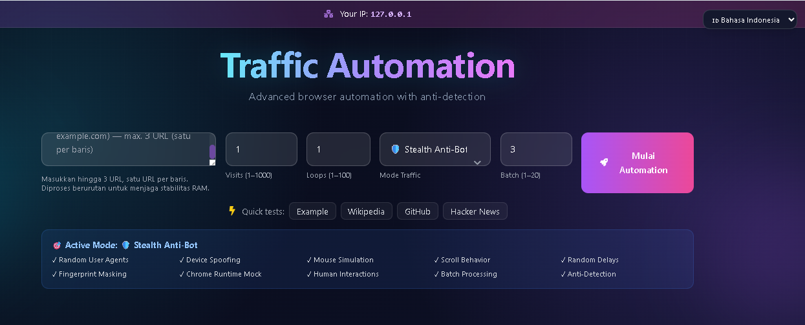

# 🚀 Traffic Automation

Platform otomasi browser berbasis React, Node.js, Express, dan Playwright untuk **pengujian website yang Anda miliki atau berwenang untuk uji**.

> Jangan gunakan aplikasi ini untuk memanipulasi traffic, iklan, ranking, analytics, atau sistem pihak lain.

<p align="center"><a href="https://saweria.co/RizalFirmansyah"></a></p>
<p align="center"><a href="https://saweria.co/RizalFirmansyah"><strong>💜 Dukung pengembangan project ini di Saweria</strong></a></p>

<p align="center">
  <a href="https://slategray-porcupine-986993.hostingersite.com" target="_blank">
    
  </a>
</p>

## 🖥️ Live demo

<p align="center">
  <a href="https://slategray-porcupine-986993.hostingersite.com">https://slategray-porcupine-986993.hostingersite.com</a>
</p>



## ✨ Fitur

- Dashboard React dengan progress real-time melalui Server-Sent Events.
- Playwright Chromium untuk pengujian navigasi, JavaScript, performa, screenshot, dan analytics.
- Mode Stealth, Storm, dan Search Engine.
- Device, viewport, timezone, locale, geolocation, dan user agent configuration.
- Hingga 3 URL yang diproses sequential agar penggunaan RAM stabil.
- Progress, hasil, error, audit log, console log, dan screenshot.
- 5 bahasa: Indonesia, English, Español, Français, dan Deutsch.
- SSRF protection, rate limit, domain allowlist, active-job limit, dan audit log.
- Ad slot responsif untuk Native Banner, desktop, mobile, dan 300×250 banner.

## 🧱 Teknologi

| Area | Teknologi |
|---|---|
| Frontend | React, Vite, Tailwind CSS, Framer Motion |
| Backend | Node.js, Express, Server-Sent Events |
| Browser | Playwright Chromium |
| Security | SSRF, DNS/IP filtering, rate limit, allowlist |
| Deployment | Docker atau Node.js runtime |

## ⚙️ Persyaratan

- Node.js 18+ dan npm 9+.
- RAM minimal 4 GB untuk pengujian ringan.
- RAM 8–12 GB untuk beberapa URL atau batch besar.
- Chromium Playwright dan dependency sistem.

Konfigurasi awal untuk RAM 12 GB:

```text
URL: maksimal 3
Mode: Stealth
Visits: 1–3
Loops: 1
Batch: 3–5
```

> Batch 20 tersedia, tetapi dapat memakai RAM sangat besar karena Chromium berjalan bersamaan. Naikkan perlahan sambil memantau RAM.

## 🛠️ Instalasi dan menjalankan

```bash
npm install
cd frontend
npm install
cd ..
npx playwright install chromium
npm run dev
```

URL default:

```text
Frontend: http://localhost:5176
Backend:  http://localhost:3006
Health:   http://localhost:3006/api/health
```

## 🌐 Mode

### Stealth

Pengujian kompatibilitas browser dan interaksi halaman pada website yang diizinkan. Mode ini bukan jaminan untuk melewati anti-bot.

### Storm

Load test terbatas pada server milik sendiri. Mulai dari batch kecil dan pantau CPU, RAM, response time, serta error rate.

### Search Engine

Memeriksa alur hasil pencarian untuk domain yang sudah terindeks. Mode dapat gagal jika domain belum diindeks, terkena CAPTCHA, diblokir regional, atau link target tidak tampil.

Mode ini tidak dapat memaksa Google/Bing menampilkan domain dan tidak boleh digunakan untuk traffic organik palsu.

## 🔗 Multi-URL

Masukkan maksimal 3 URL, satu URL per baris:

```text
https://example-one.com
https://example-two.com
https://example-three.com
```

URL diproses sequential. Setiap URL melewati validasi format, DNS, IP private, dan domain policy.

## 🔒 Environment variables

```env
NODE_ENV=production
PORT=10000
MAX_ACTIVE_JOBS=1
AUTOMATE_RATE_LIMIT=5
MAX_VISITS=1000
ALLOWED_DOMAINS=staging.example.com,qa.example.org
```

`ALLOWED_DOMAINS` sangat disarankan untuk deployment publik. Health check:

```http
GET /api/health
```

## 📊 Analytics dan geolocation

Timezone, locale, dan geolocation browser tidak mengubah negara di Google Analytics. GA4 terutama memperkirakan lokasi dari IP publik saat event dikumpulkan.

Untuk pengujian sah, gunakan staging property atau event khusus seperti `authorized_test_visit`, pisahkan data test dari production, dan jangan menyamarkan traffic pengujian sebagai traffic pengguna nyata.

## 🧪 Troubleshooting

### Search Engine tidak menemukan website

1. Cari manual dengan `site:example.com`.
2. Daftarkan website di Search Console dan Bing Webmaster Tools.
3. Kirim sitemap.
4. Periksa `robots.txt`, canonical, dan meta `noindex`.
5. Pastikan response website HTTP 200.
6. Periksa log backend untuk redirect hasil pencarian.

### Chromium gagal dibuka

```bash
npx playwright install chromium
```

Kurangi batch, tutup aplikasi berat, dan pastikan RAM cukup.

### `Target link not found`

Search engine tidak memberikan link target yang dapat divalidasi. Ini berbeda dari error browser atau URL.

## 🐳 Docker

```bash
docker build -t traffic-automation .
docker run --rm -p 10000:10000 -e NODE_ENV=production -e PORT=10000 -e MAX_ACTIVE_JOBS=1 traffic-automation
```

## 💰 Dukungan project

Jika project ini membantu pekerjaan Anda, dukung pengembangannya:

<p align="center"><a href="https://saweria.co/RizalFirmansyah"></a></p>

👉 [Dukung melalui Saweria](https://saweria.co/RizalFirmansyah)

## 📄 Lisensi

Project ini dirilis di bawah lisensi MIT. Lihat [LICENSE](./LICENSE).

## ⚖️ Responsible usage

Anda bertanggung jawab atas target, data, akun, dan traffic yang diproses menggunakan software ini. Pastikan aktivitas mematuhi hukum, Terms of Service, kebijakan search engine, kebijakan analytics, dan izin pemilik website.
